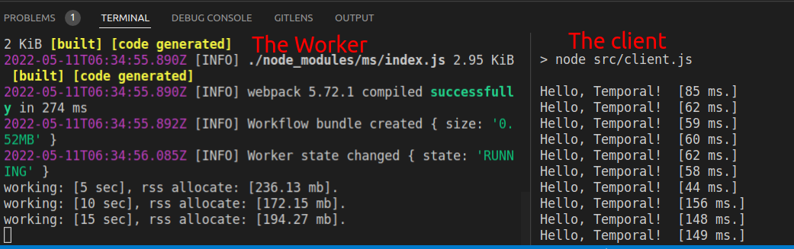
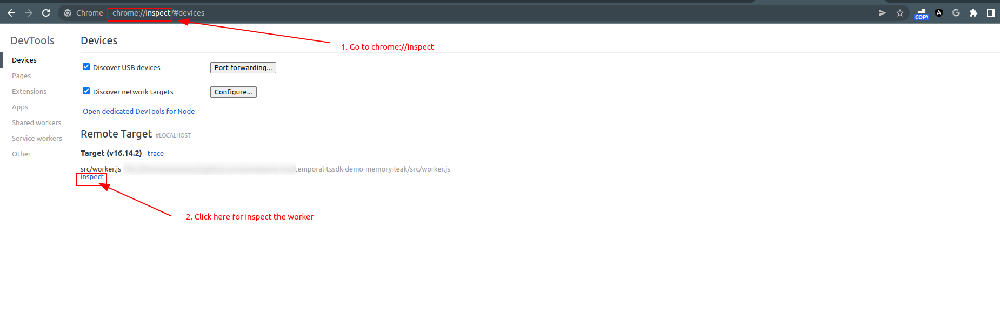
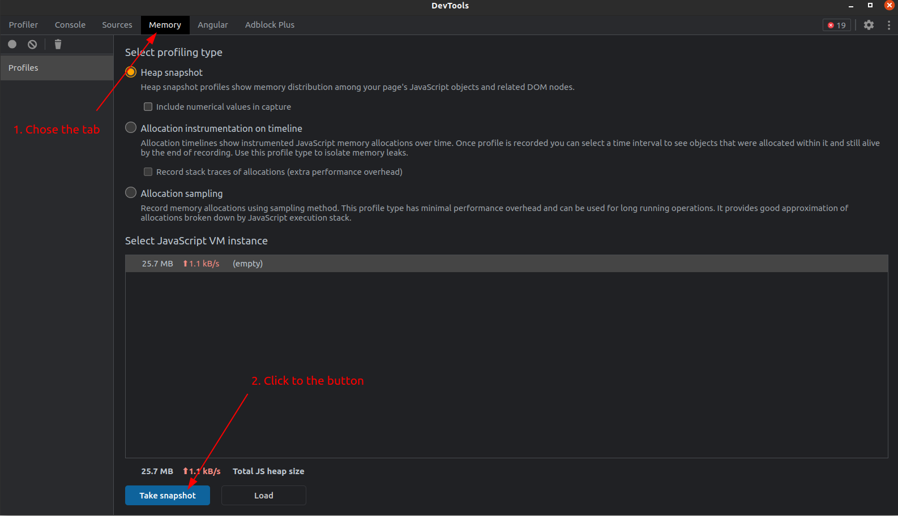
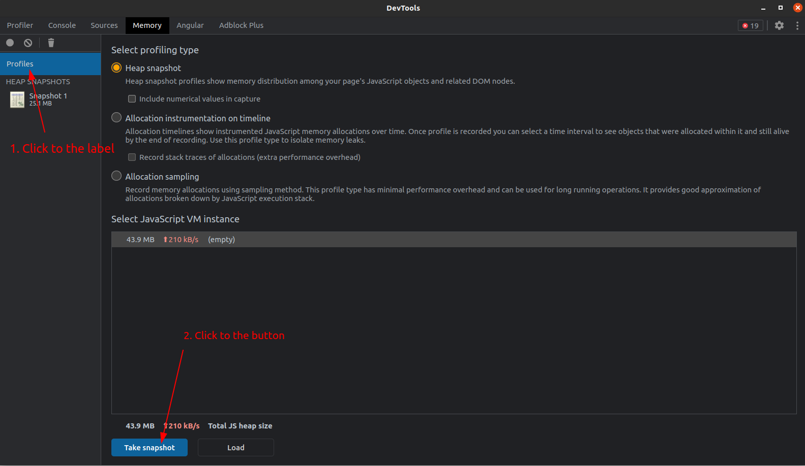
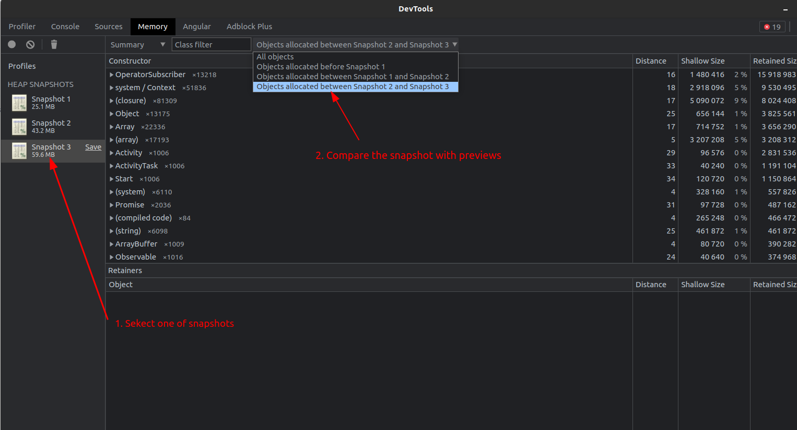
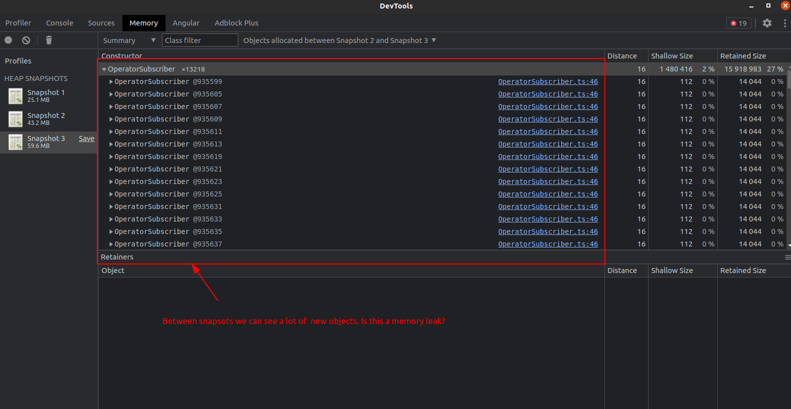

# Temporal typescript sdk demo memory leak
Demonstration the memory leak of temporal typescript sdk.

Some times ago we began using the temporal SDK in our microservice product, but after some times we detected that temporal-worker containers are killed by "out of memory" reason. Then we started our investigation and found the potential leak problem: a lot of 'OperatorSubscriber' objects create on temporal-worker side,  but it never clean, and it make memory leak problem. Right now it's  just a theory, but we hope that you can help us with checking it.

## Intro

We have a primitive temporal [client](./src/client.js) and a temporal [worker](./src/worker.js). 

The client calls execute [the workflow](./src/workflows.js) in infinity loop and logging executing time on console. 

The worker just is executing [the workflow](./src/workflows.js) and every 5 seconds logged his allocated memory(`process.memoryUsage().rss`).

## Primitive memory leak representation

1. Install dependencies: `npm ci`

2. Deploy temporal server (if it's necessary) via docker-compose: `docker-compose up --build -d`

3. Start the worker: `npm run worker`

4. Start the client in another terminal: `npm run client`
   

5. Wait about 10 minutes

6. Now we can see -- the memory allocated size is up (in our case the memory raised from ~200mb to ~360mb)
   

## Memory leak inspection via chrome dev tools

Also we can investigate the leak problem via chrome dev tools. 

1. Start the worker with inspect mode: `npm run worker:inspect`

2. Open chrome browser and go to `chrome://inspect` and click to "inspect" for worker's target
   

3. When open DevTools inspect window -- choose the Memory tab and click to the "Take snapshot" button

4. Next start the client in another terminal `npm run client`
   
5. After some times -- take memory snapshot again. For it -- click to the "Profiles" label and click to the "Take snapshot" button

6. If needed, you can take more snapshots after some intervals. In my case I totally take three snapshots. 

7. Select one of snapshots(e.g. last) and compare its state with preview

8. And how we can see -- there are a lot of `OperatorSubscriber` objects between snapshots, and we can make the conclusion, that temporal typescript SDK has a memory leak

I attached my snapshots [here](data/snapshots.tar.gz) as a tar.gz archive, and you can make it out.

