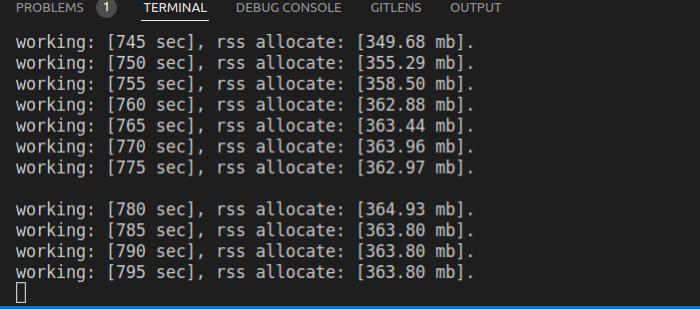
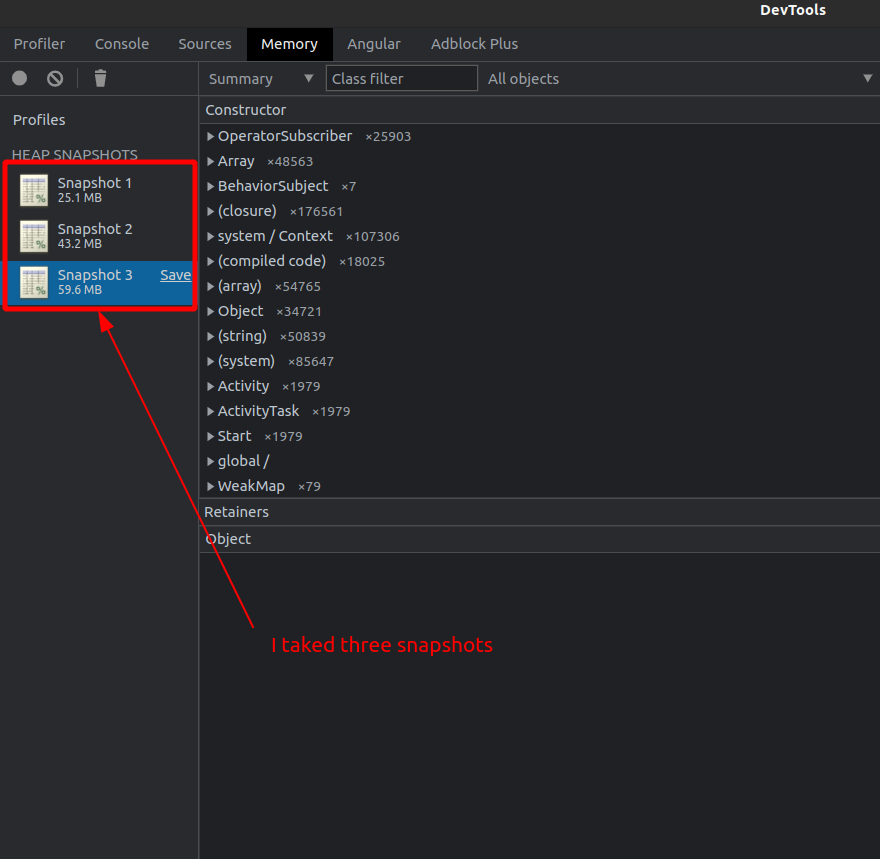

# Temporal typescript sdk demo memory leak
Demonstration memory leak of temporal typescript sdk.

Some times ago we begin using the temporal SDK in our microservice product, but after some times we detect killed temporal-worker containers by "out of memory" reason. Then we begin our investigation and find the potential leak problem: on temporal-worker side create a lot of `OperatorSubscriber` objects, but they never clean, and it make memory leak problem. Right now it just a theory, but we hope that you can help we with checking it. 

## Intro

We have a primitive temporal [client](./src/client.js) and a temporal [worker](./src/worker.js). 

The client calls execute [the workflow](./src/workflows.js) in infinity loop and logging executing time on console. 

The worker just executing [the workflow](./src/workflows.js) and every 5 second logged his allocated memory(`process.memoryUsage().rss`).

## Primitive memory leak representation

1. Install dependencies: `npm ci`

2. Up temporal server(if need) via docker-compose: `docker-compose up --build -d`

3. Start the worker: `npm run worker`

4. Start the client in another terminal: `npm run client`
   

5. Wait about 10 minutes

6. How we can see -- the memory allocated size is up(in our case the memory upped from ~200mb to ~360mb)
   

## Memory leak inspection via chrome dev tools

Also we can investigate the leak problem via chrome dev tools. 

1. Start the worker with inspect mode: `npm run worker:inspect`

2. Open chrome browser and go to `chrome://inspect` and click to "inspect" for worker's target
   

3. When open DevTools inspect window -- chose the Memory tab and click to the "Take snapshot" button

4. Next start the client in another terminal `npm run client`
   
5. After some times -- take memory snapshot again. For it -- click too the "Profiles" label and click to the "Take snapshot" button

6. If need, you can take more snapshots after some intervals. In my case I total take three snapshots. 

7. Select one of snapshots(e.g. last) and compare its state with preview

8. And how we can see -- between snapshots has a lot of `OperatorSubscriber` objects, and we can make the conclusion, that temporal typescript SDK has a memory leak

I attache my snapshots [here](data/snapshots.tar.gz) as a tar.gz archive, and you can self analyzing it.

